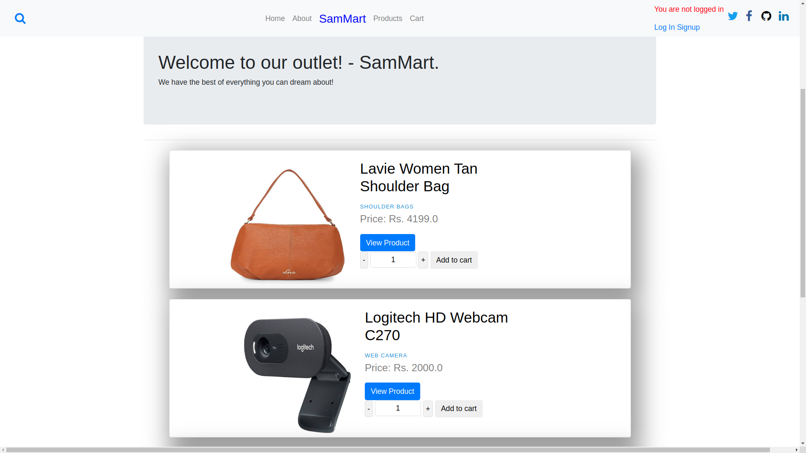
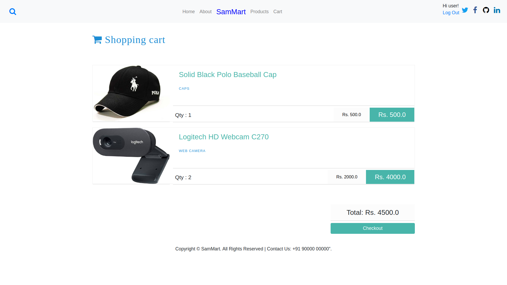
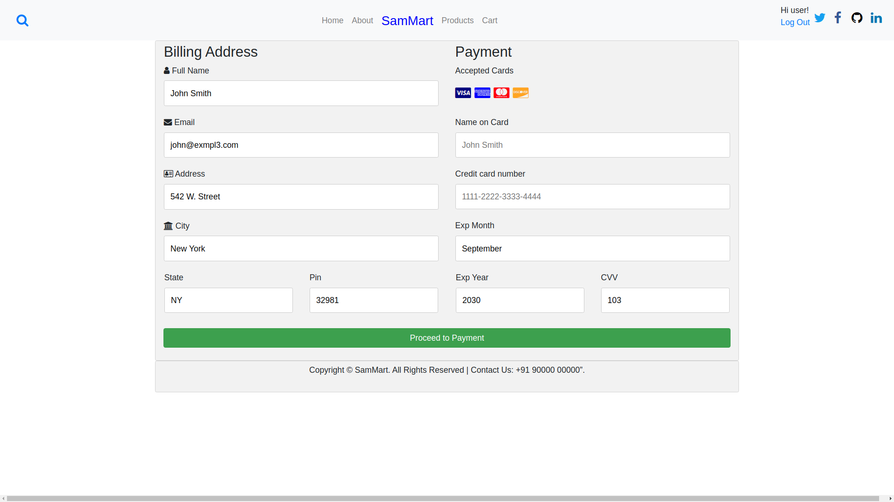
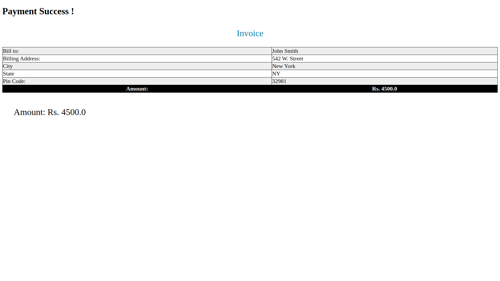

# eCom

An ecommerce website project using Django(Python) as backend.The application uses sqlite3 as its database and CSS with Bootstrap as a frontend.

## Users
User can view the details of the products added. The project also includes features like adding the products to user's cart and even generating the invoice of the items ordered. 
Some features like Order Tracking are yet to be included.

## Admin
The features for the admin ranges from adding a product to the application to the management and assignment of responsibilities to the general users. Admin enjoys the functions to control the application including viewing the products added into a user's cart.
The personal details of the user (including payment transaction details), however are not visible to the admin, in order to secure transactions and maintain privacy of the user. 

## The Application
Find below the screenshots of the running application.


## Index Page 1


## Index Page 2



## Cart Page



## Billing Page



## Invoice Page



## How to Use
Download the project and in the terminal, run the following commands, 

```bash
1)  python3 manage.py makemigratons
```

```bash
2)  python3 manage.py migrate
```

```bash
3)  python3 manage.py runserver 8000
```
Next, open (http://localhost:8000/webapp) in your browser and enjoy.
